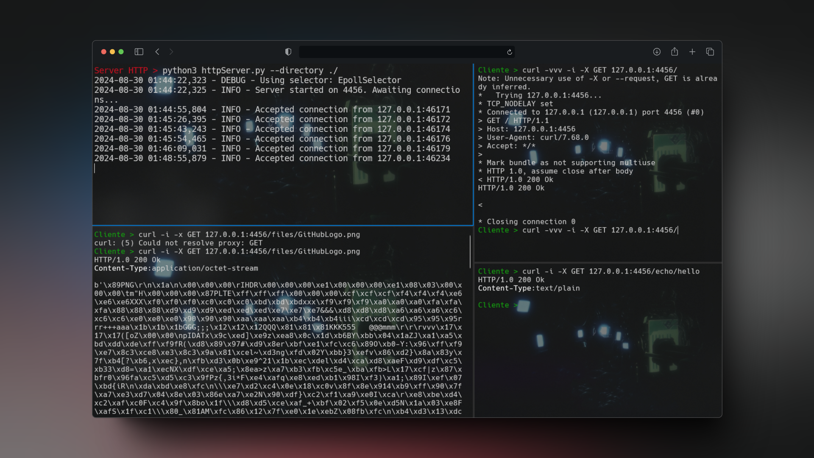

# HTTP Server - TCP-based Web Server

A simple asynchronous HTTP server built on a TCP foundation using Python. Supports basic GET and POST requests, with file handling and custom routes.




## Features

- **Supported Methods**: `GET`, `POST`
- **Routing**: Define custom routes with specific responses.
- **File Handling**: 
  - Serve files via GET requests.
  - Upload content via POST requests.
- **Utility Routes**: 
  - `/echo/<message>`: Echoes the URL message.
  - `/user-agent`: Returns the client's `User-Agent`.

## Running the Server

```bash
python3 httpServer.py --ip 0.0.0.0 --port 4456 --directory ./files
```

Options:
- `--ip`: IP address (default: `0.0.0.0`)
- `--port`: Port (default: `4456`)
- `--directory`: Directory for file handling (optional)

## Example Requests

- **GET**: `curl http://localhost:4456/echo/Hello`
- **POST**: `curl -X POST -d "content" http://localhost:4456/files/test.txt`
